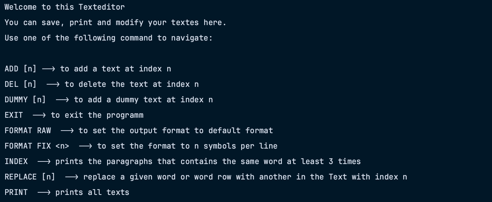

<a name="readme-top"></a>
                 
<!-- Einführung -->
<div align="center">

  <h1 align="center">TextEditor</h1>

  <p align="center">
    team2-numeroUNO-projekt2-texteditor
    <br />
    <a href="https://github.zhaw.ch/PM1-IT23aWIN-fame-kars-wahl/team2-numeroUNO-projekt2-texteditor/blob/main/documentation/Klassendiagramm/Klassenmodell.md">
        <strong>Zum Modell »</strong>
    </a>
    <br />
    <br />
    <a href="https://github.zhaw.ch/PM1-IT23aWIN-fame-kars-wahl/team2-numeroUNO-projekt2-texteditor/blob/main/documentation/Klassendiagramm/Klassenbeschreibungen.md">
        Klassenbeschreibungen
    </a>
    ·
    <a href="https://github.zhaw.ch/PM1-IT23aWIN-fame-kars-wahl/team2-numeroUNO-projekt2-texteditor/blob/main/documentation/Klassendiagramm/testingconcept.md">
        Testingkonzept
    </a>
  </p>
</div>


<!-- Inhaltsverzeichnis -->
<details>
  <summary>Inhaltsverzeichnis</summary>
  <ol>
    <li>
      <a href="#über-das-projekt">Über das Projekt</a>
      <ul>
        <li><a href="#entwickelt-mit">Entwickelt mit</a></li>
      </ul>
    </li>
    <li>
      <a href="#erste-schritte">Erste Schritte</a>
      <ul>
        <li><a href="#voraussetzungen">Voraussetzungen</a></li>
        <li><a href="#installation">Installation</a></li>
      </ul>
    </li>
    <li><a href="#lizenz">Lizenz</a></li>
  </ol>
</details>


## Über das Projekt
<div align="center">
    
</div>

Ein Texteditor integriert in eine IDE-Konsole, ermöglicht effiziente Textbearbeitung 
mit umfangreichen Funktionen. Diese beinhalten das Hinzufügen, Löschen, Bearbeiten und Formatieren von Texten. 
Die Anwendung bietet eine nahtlose Integration in die Entwicklungsplattform und erlaubt so eine komfortable 
und leistungsstarke Nutzung für unterschiedlichste Textmanipulationen.

<p align="right">(<a href="#readme-top">back to top</a>)</p>

### Entwickelt mit

![Java][Java]

<p align="right">(<a href="#readme-top">back to top</a>)</p>


## Erste Schritte
   
Dies ist ein Beispiel dafür, wie du Anweisungen zur Einrichtung deines Projekts lokal geben könntest. 

### Voraussetzungen

Du hast Java 20 oder neuer auf deinem System.         

### Installation

1. Clone das Repo
   ```sh
   git clone https://github.zhaw.ch/PM1-IT23aWIN-fame-kars-wahl/team2-numeroUNO-projekt2-texteditor
   ```
2. Starte das Programm
   ```sh
   java main.java
   ```

<p align="right">(<a href="#readme-top">back to top</a>)</p>


## Lizenz

MIT Lizenz.

<p align="right">(<a href="#readme-top">back to top</a>)</p>


[Java]: https://img.shields.io/badge/java-%23ED8B00.svg?style=for-the-badge&logo=openjdk&logoColor=white
