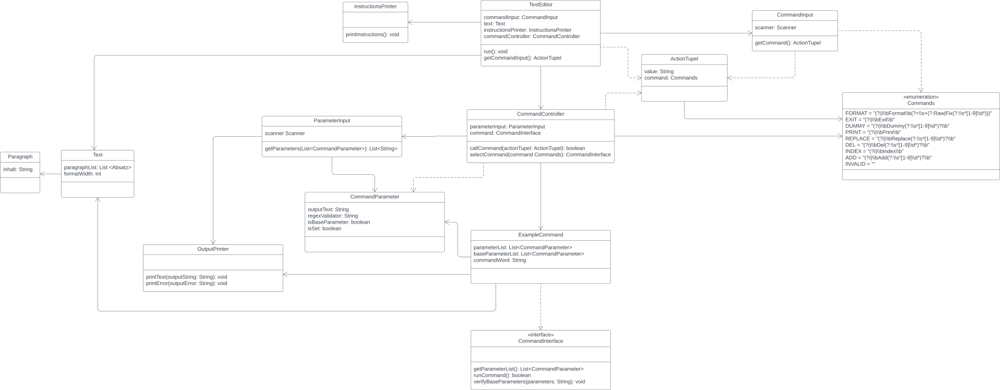
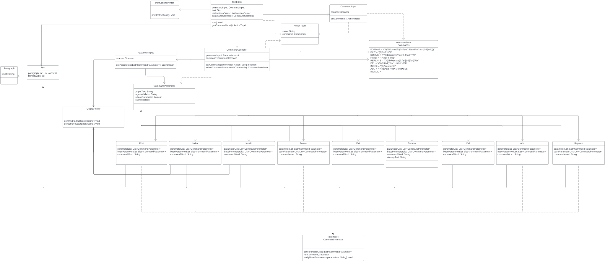

# Klassenmodell

# Klassendiagramm

### Klassendiagramm mit Beispielbefehl
! Bei diesem Klassendiagramm wurden die Befehle, zwecks Übersichtlichkeit, zu einem ExampleCommand zusammengefasst. !

### Klassendiagramm mit allen Befehlen

